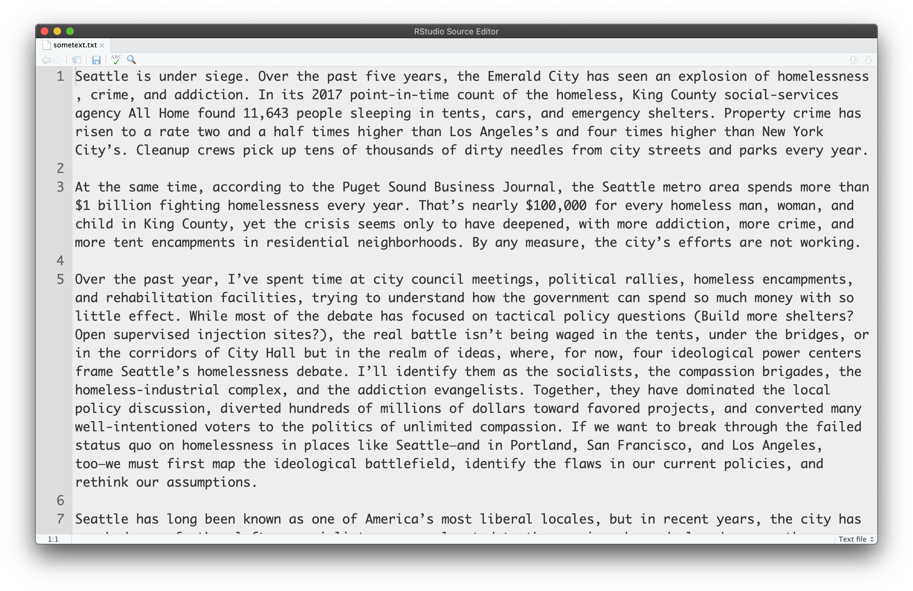

---
output:
  html_document: default
  pdf_document: default
---
<br> 
<center></center>


## Course: VISUAL ANALYTICS FOR POLICY AND MANAGEMENT

### Prof. José Manuel Magallanes, PhD 
* Visiting Professor of Computational Policy at Evans School of Public Policy and Governance, and eScience Institute Senior Data Science Fellow, University of Washington.
* Professor of Government and Political Methodology, Pontificia Universidad Católica del Perú. 


_____


# Text Data
_____


Text can be used for plotting. The plots however require some that we previously   do some particular operations on the text because words can have several inflections. In this session, you will see the construction of **word clouds**. These plots represent a variation of bar plots for categories, but are attractive to the eye to show text.


1. Get the text:

Let me get a data frame with texts from some tweets:

```{r}
# clean memory
rm(list = ls()) 
link1="https://github.com/EvansDataScience/VAforPM_Text/"
link2="raw/main/trumps.csv"
trumpLink=paste0(link1,link2)
allTweets=read.csv(trumpLink ,stringsAsFactors = F)
```

The data has this columns:

```{r}
names(allTweets)
```
The Twitter text column has this information:

```{r}
head(allTweets$text,2)
```


2. Make some selection:

This data frame has some columns that allow subsetting. In this case, I will keeping tweets that are not retweets.

```{r}
DTtweets=allTweets[allTweets$is_retweet==FALSE ,] 
DTtweets=DTtweets[,c(1,2)]
#some
head(DTtweets,3)
```

3. Turn the text messages into words.

This process, also known as **tokenization**, will produce a simpler element from the input text, in this case words:

```{r}
library(tidytext) 
library(magrittr) 
DTtweets_Words = DTtweets %>%
                 unnest_tokens(output=EachWord, # column created
                               input=text,# input column from DTtweets
                               token="words") # level of unnesting

head(DTtweets_Words,10) # notice 'EachWord'
```

You have these many 'words':

```{r}
nrow(DTtweets_Words) # count of words
```


4. Getting rid of **common words**: These are know as the _STOP WORDS_:

```{r}
# calling the file 
data(stop_words)
# seeing some 'STOP WORDS'  
head(stop_words)
```

Then, we  remove the stop words from the _EachWord_ column:

```{r, message=FALSE}
library(dplyr)

 # The column 'word' from 'stop_words' will be compared # to the column 'EachWord' in 'DTtweets_Words' 
DTtweets_Words = DTtweets_Words %>%anti_join(stop_words,
                                             by = c("EachWord" = "word"))

# You have these many rows now:

nrow(DTtweets_Words) # count of words
```

5. Compute **frequency** of each word:

Here, you are simply producing a frequency table. You could create a barplot with this.

```{r}
forCloud=as.data.frame(table(DTtweets_Words$EachWord))
names(forCloud)=c('EachWord','Counts')
#sorting by count:
forCloud_ascending=forCloud[order(forCloud$Counts),]
```

Let's see the top and bottom of the data frame:

```{r}
head(forCloud_ascending,10)
```

```{r}
tail(forCloud_ascending,10)
```
 
Text, especially from tweets or similar platforms, bring unexpected _words_, so you may need to some extra cleaning manually:
 
```{r}
# dropping by text:
badWords=c('https','t.co')
forCloud_ascending=forCloud_ascending[!forCloud_ascending$EachWord%in%badWords,]

# dropping by count:
forCloud_ascending=forCloud_ascending[forCloud_ascending$Counts>4,]
```
 


6. Create a word cloud:

Write the code to produce the cloud below.

```{r, echo=TRUE, eval=TRUE, message=FALSE}
library(ggwordcloud)

ggplot(forCloud_ascending, 
       aes(label = EachWord, size = Counts,color = Counts)) +
    geom_text_wordcloud_area() +
    theme_minimal() +
    scale_color_gradient(low = "red", high = "darkred")

```

You can improve this using **scale_size_area()**:
```{r}
ggplot(forCloud_ascending, aes(label = EachWord, size = Counts,color = Counts)) +
  geom_text_wordcloud_area(eccentricity = 0.65) +
  theme_minimal() + scale_size_area(max_size = 13)+ # try increasing
  scale_color_gradient(low = "red", high = "darkred")
```

Notice that the order of the data frame with counts matters:

```{r}
forCloud_descending=forCloud_ascending[order(-forCloud_ascending$Counts),]

#now

ggplot(forCloud_descending, aes(label = EachWord, size = Counts,color = Counts)) +
  geom_text_wordcloud_area(eccentricity = 0.65) +
  theme_minimal() + scale_size_area(max_size = 13)+ # try increasing
  scale_color_gradient(low = "red", high = "darkred")
```

You do not always tweets, buy some simple text like this:



You can simply save that text as a **txt** file. Let me work with that file:

```{r, warning=FALSE}
otherText <- read.delim("sometext.txt",header = F)
```

Write the code to produce obtain each word:
```{r}
otherText_words=otherText %>%
               unnest_tokens(output=EachWord,
                             input=V1,
                             token="words")%>%
               anti_join(stop_words,
                         by = c("EachWord" = "word"))
# you get
head(otherText_words,20)
```
Now you can prepare a frequency table, let's learn **count** from **dplyr**:
```{r}
txtAsc_descending=dplyr::count(otherText_words,EachWord,
                               name='Counts',
                               sort = TRUE)
# result
head(txtAsc_descending,10)
```


```{r}
# let's subset:
               

txtAsc_descending=txtAsc_descending[txtAsc_descending$Counts>4,]

ggplot(txtAsc_descending, 
       aes(label = EachWord, 
           size = Counts,color = Counts)) +
  geom_text_wordcloud() +
  scale_size_area(max_size = 10) +
  theme_minimal() +
  scale_color_gradient(low = "red", high = "darkred")
```


